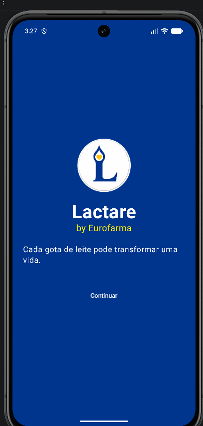
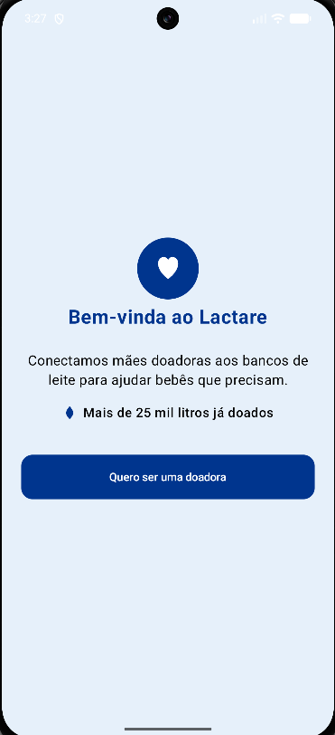
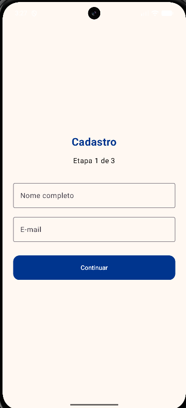
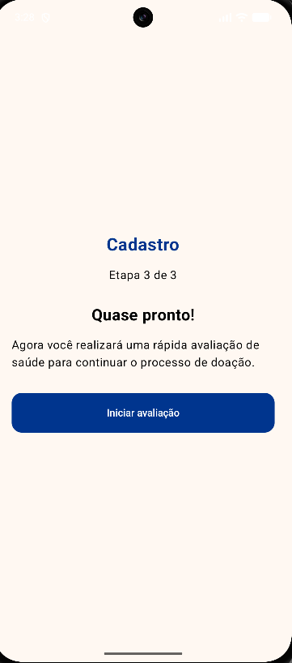
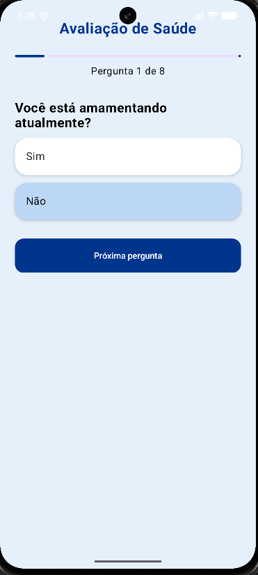
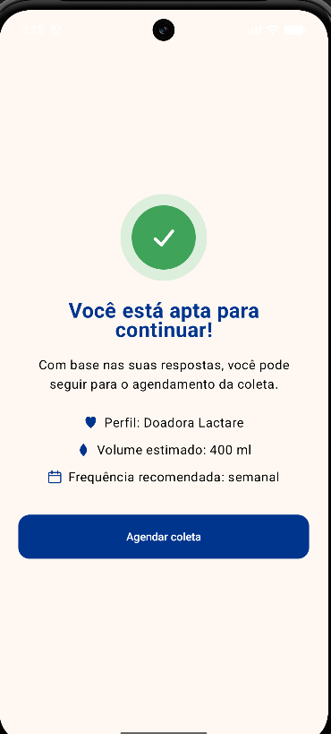
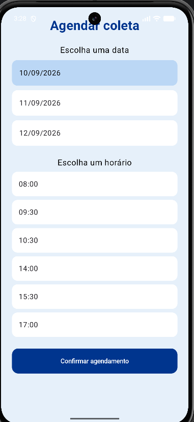
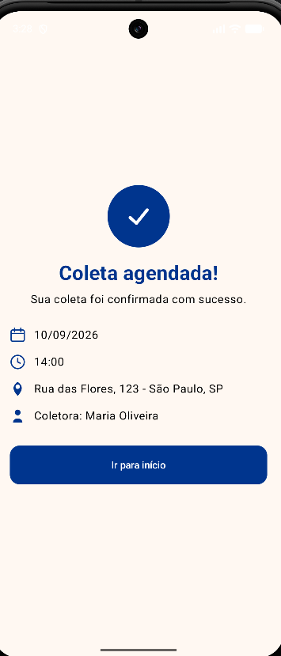
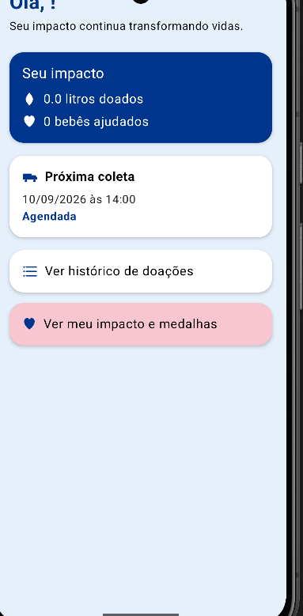

# Lactare by Eurofarma

Aplicativo Android (Kotlin + Jetpack Compose) que conecta mães doadoras de leite humano a bancos de leite hospitalares, facilitando o cadastro, a triagem de elegibilidade e o agendamento da coleta.

Projeto desenvolvido para a disciplina de Kotlin/Android da FIAP — Sprint 3 (MVP navegável com dados mockados).

## Equipe

**Equipe:** Lactare

| Integrante | RM |
|---|---|
| Giovanni Sguizzardi Conde | RM565123 |
| Nicole Alves Nogueira | RM555182 |
| Lucas Lima Franco | RM550255 |
| Bruno César Toledo D'Oliveira | RM554878 |
| João Victor Oliveira Avellar | RM550283 |

**Repositório GitHub:** https://github.com/brunotld/Lactare_by_Europharma

## Objetivo do aplicativo

O Lactare nasce do problema de bancos de leite humano dependerem de doações voluntárias, mas terem dificuldade em captar e reter doadoras de forma organizada. O app resolve isso oferecendo, num único fluxo:

- Cadastro simples da doadora;
- Um quiz de saúde que avalia a elegibilidade dela para doar;
- Agendamento da coleta domiciliar em data/horário à escolha;
- Confirmação e acompanhamento do agendamento;
- Um painel de impacto que mostra, de forma gamificada (litros doados, bebês ajudados, medalhas), o resultado concreto das doações — incentivando a doadora a continuar doando.

Nesta Sprint, todo o fluxo funciona com dados mockados (sem backend/API/Firebase), simulando o comportamento esperado da versão real.

## Escopo funcional implementado

Requisitos funcionais escolhidos para esta Sprint, e por quê:

1. **Cadastro da doadora** — ponto de entrada de qualquer usuária nova; sem ele não há como personalizar o restante do fluxo.
2. **Quiz de saúde / triagem de elegibilidade** — é o core do problema: bancos de leite não podem aceitar qualquer doação, existe um crivo de segurança. Simulsamos isso com perguntas de sim/não que levam a uma tela de resultado.
3. **Agendamento de coleta** (data + horário) — converte a intenção de doar em uma ação concreta agendada.
4. **Confirmação do agendamento** — dá retorno claro à usuária de que a ação foi registrada, com os dados que ela mesma escolheu (não um valor fixo).
5. **Home com resumo do impacto e da próxima coleta** — tela central do app, reforça o vínculo da doadora com a causa a cada abertura.
6. **Histórico de doações** — mostra o que já foi doado (por doação concluída), reforçando confiança/transparência.
7. **Tela de impacto e medalhas (gamificação)** — funcionalidade de retenção: transforma litros doados em "bebês ajudados" e desbloqueia medalhas conforme o progresso real da usuária.

Priorização: o grupo optou por implementar o fluxo **ponta a ponta** (cadastro → triagem → agendamento → confirmação → acompanhamento) em vez de muitas telas soltas, porque o pitch original defende que o maior obstáculo dos bancos de leite é a jornada fragmentada da doadora. Um fluxo completo, mesmo que mockado, demonstra melhor a proposta de valor do que telas isoladas com mais funcionalidades superficiais.

## Telas do aplicativo

> As imagens abaixo devem ser prints reais do app rodando no Android Studio/emulador/dispositivo — faltam os prints de **Histórico** e **Impacto**, adicione em `docs/screenshots/history.png` e `docs/screenshots/impact.png` antes da entrega.

| Tela | Descrição |
|---|---|
| **Splash** | Tela de abertura com a marca Lactare e o call-to-action inicial. |
| **Boas-vindas** | Explica a proposta do app e convida a usuária a se cadastrar como doadora. |
| **Cadastro** | Formulário com dados da doadora (nome, contato, endereço), em 3 etapas. |
| **Quiz de saúde** | Perguntas de triagem para avaliar a elegibilidade da doadora. |
| **Resultado da avaliação** | Confirma que a doadora está apta e resume o perfil sugerido (volume estimado, frequência). |
| **Agendamento de coleta** | Seleção de data e horário disponíveis para a coleta domiciliar. |
| **Confirmação de agendamento** | Exibe os dados reais da coleta que a doadora acabou de marcar (data, horário, endereço, coletora). |
| **Home** | Painel com o impacto acumulado da doadora e a próxima coleta agendada. |
| **Histórico de doações** | Lista as doações já concluídas pela doadora. |
| **Impacto e medalhas** | Mostra litros doados, bebês ajudados e medalhas desbloqueadas conforme o progresso real da usuária. |

## Dados mockados

Todos os dados simulados estão centralizados em `app/src/main/java/com/example/lactare/data/MockData.kt`, separados dos arquivos de tela, e organizados a partir de modelos próprios em `model/`:

- `User` — doadoras cadastradas (nome, contato, endereço, litros doados, bebês ajudados);
- `Donation` — doações já concluídas, vinculadas a um `userId`;
- `Appointment` — coleta agendada (data, horário, endereço, coletora, status);
- `QuizQuestion` — perguntas do quiz de saúde;
- `Badge` — medalhas de gamificação, com regra de desbloqueio baseada nos dados reais da usuária (ex.: "realizou a primeira doação", "ajudou 5 bebês").

Ao se cadastrar, a usuária ganha um `User` novo (com `totalDonatedMl` e `babiesHelped` zerados, como uma conta real começaria) e passa a interagir com o app usando os próprios dados — o agendamento que ela faz, o histórico e o impacto exibidos são dela, não de um mock fixo.

## Funcionalidades implementadas

- Cadastro de doadora;
- Quiz de elegibilidade com resultado dinâmico;
- Agendamento de coleta (data/horário escolhidos pela usuária, refletidos na confirmação e na Home);
- Histórico de doações filtrado por usuária;
- Painel de impacto com medalhas que desbloqueiam de acordo com o progresso real da conta;
- Navegação completa entre todas as telas, com passagem de parâmetros (`User`, `Appointment`) entre elas.

## Tecnologias utilizadas

- Kotlin
- Jetpack Compose (UI declarativa)
- Navigation Compose (navegação entre telas)
- Material 3
- Gerenciamento de estado com `remember` / `mutableStateOf`
- Android Studio (Gradle Kotlin DSL, `compileSdk 37`, `minSdk 24`)

## Como executar o projeto

1. Abra a pasta do projeto no Android Studio (versão Ladybug ou superior recomendada).
2. Deixe o Gradle sincronizar as dependências automaticamente.
3. Selecione um emulador (API 24+) ou conecte um dispositivo físico.
4. Rode o app clicando em **Run ▶** (ou `Shift+F10`).
5. O app abre na tela de Splash e segue o fluxo: Boas-vindas → Cadastro → Quiz → Resultado → Agendamento → Confirmação → Home.

Não é necessária nenhuma configuração de API, backend ou variável de ambiente — todos os dados são mockados localmente.
# Lactare_by_Europharma
